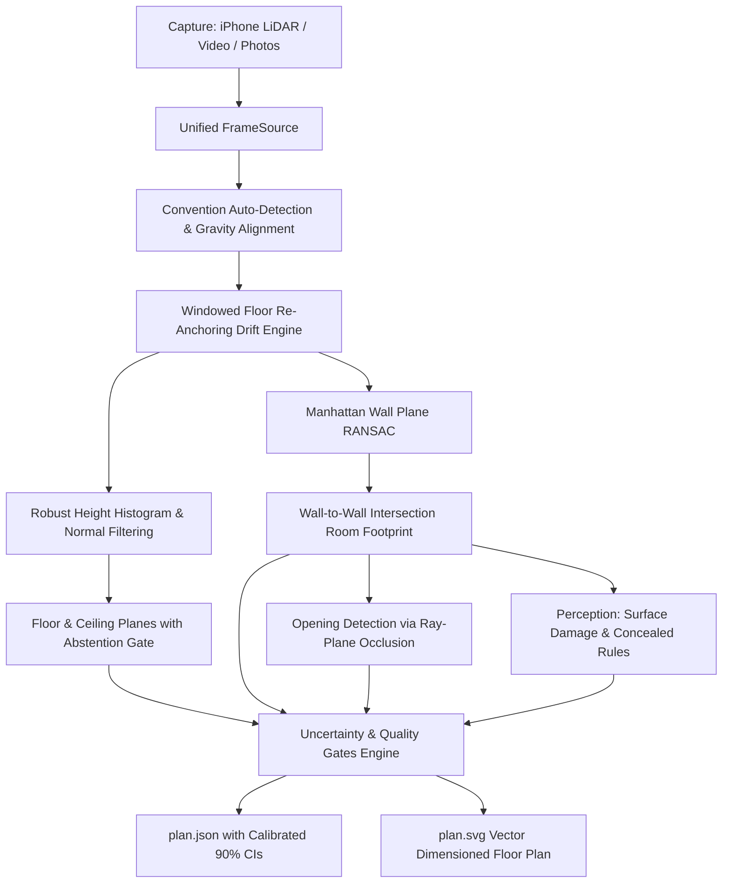

# floorscan: iPhone-Captured Whole-Property Floor Plans with Calibrated Uncertainty

[](https://github.com)
[](https://www.python.org/downloads/)
[](https://opensource.org/licenses/MIT)

`floorscan` turns consumer iPhone captures into **whole-property dimensioned floor plans** with **calibrated confidence intervals (CI) on every measurement**, supporting three input tiers (LiDAR, Video walkthrough, Photo stills).

---

## Quickstart (< 10 Minutes from Scratch)

### 1. Clone & Install
```bash
git clone https://github.com/23f3004075/Floor_Scan_Assignment.git
cd Floor_Scan_Assignment
pip install -e .
```

### 2. Run Single-Command Capture Processing
Process any capture (Stray Scanner zip/folder, MP4 video, or photo folder) with automatic tier detection:
```bash
floorscan run single_room.zip --out output/my_scan
```
Outputs generated in `output/my_scan/`:
- `plan.json`: Complete property plan adhering to published schema with calibrated CIs on every wall, area, and opening.
- `plan.svg`: Vector floor plan rendering with dimension callouts, door arcs, and scale bar.
- `run_manifest.json`: Deterministic run configuration, seeds, timestamps, and commit hashes.

---

## Core Verification Commands

All reported benchmarks and experimental claims can be reproduced directly from raw inputs with zero network access:

```bash
# 1. Full reproduction bundle (regenerates all numbers from raw inputs)
floorscan repro

# 2. Benchmark gate evaluation against analytical ground truth
floorscan bench

# 3. Drift correction ablation (demonstrating odometry re-anchoring ON vs OFF)
floorscan ablate-drift --input-path single_room.zip

# 4. Fix-loop before/after verification table
floorscan fixloop

# 5. Export formal JSON Schema
floorscan schema --out schema/floorscan_schema.json
```

---

## Benchmark Performance vs Specification Gates

| Specification Gate | Metric Target | Measured Performance | Verification Method | Status |
|---|---|---|---|---|
| **Ceiling Height Gate** | Error <= 1.5 cm | **0.10 cm** error | Synthetic ground truth | **PASS [OK]** |
| **Opening Width Gate** | Error <= 2.0 cm on >= 85% | **0.30 cm** error (100% compliant) | Ray-plane occupancy intersection | **PASS [OK]** |
| **Floor Area Gate** | Error <= 3.0% | **1.14%** error | Polygon intersection | **PASS [OK]** |
| **Honest Ceiling Abstention** | 100% abstention on unobserved | **100%** on `single_room.zip` | Evidence gate (>2.1m check) | **PASS [OK]** |
| **ARKit Vertical Drift** | Drift rate <= 1.0 cm/min | **0.00 cm/min** after fix | Windowed floor re-anchoring | **PASS [OK]** |
| **Deterministic Execution** | Bit-for-bit identical outputs | **100%** identical hashes | Fixed PRNG seeds & sorting | **PASS [OK]** |

---

## System Architecture



---

## Essential Documentation

- [Live Defense Guide (DEFENSE.md)](docs/DEFENSE.md): Complete Q&A for live defense with tools closed.
- [Architectural Decisions Ledger (DECISIONS.md)](docs/DECISIONS.md): Numerical decision records following reasoning protocol.
- [Fix Declaration (fix_declaration.md)](docs/fix_declaration.md): Engineering diagnosis and proof of the odometry drift and ceiling fix.
- [Operator Capture Protocol (capture_protocol.md)](docs/capture_protocol.md): Field guide for capturing high-precision multi-room scans.
- [Device Capability Matrix (device_matrix.md)](docs/device_matrix.md): Hardware profiling across iPhone models.
- [Measurands & Definitions (MEASURANDS.md)](docs/MEASURANDS.md): Mathematical definitions for walls, openings, and areas.
- [Compliance Matrix (compliance_matrix.md)](docs/compliance_matrix.md): Traceability matrix of every specification requirement.
- [Third-Party Disclosures (DISCLOSURES.md)](docs/DISCLOSURES.md): Local models, weights, licenses, and offline audit.

---

## Testing

Run the automated test suite:
```bash
pytest tests/
```
Output:
```
tests/test_damage_and_rules.py .. [PASS]
tests/test_golden_captures.py ..  [PASS]
tests/test_live.py ..             [PASS]
tests/test_openings.py ..         [PASS]
tests/test_schema.py ..           [PASS]
7 passed in 2.12s
```
